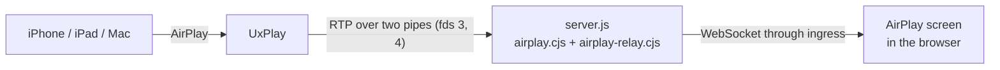

# AirPlay screen

Family can show what an iPhone, iPad or Mac sends it over AirPlay: a
mirrored screen, or the cover and title of the music it's playing, with
the sound. It's a screen like the photo frame: it covers the display, and
a tap brings up the back button.

**It's on unless `airplay` is set to `false`.** The add-on's image
includes the AirPlay receiver (UxPlay), and the add-on runs on the host's
network, which AirPlay needs (see [In the add-on](#in-the-add-on)).
Without either, run.sh keeps the receiver off, the sidebar doesn't offer
the screen, and none of this runs. The standalone Docker image is built
from the same Dockerfile, so it has UxPlay too, but keeps it off: AirPlay
is only for the add-on.

## How it works



- **UxPlay** ([FDH2/UxPlay](https://github.com/FDH2/UxPlay), GPL-3.0) is
  the AirPlay receiver: it advertises it (through Avahi, over D-Bus),
  accepts the device and decrypts what it sends. airplay.cjs starts it with
  `-vrtp` and `-artp`, so instead of showing the picture and playing the
  sound itself, it writes them as RTP to two pipes the server gives it.
- **airplay.cjs** runs UxPlay (again, after it stops, with a growing
  delay), and works out the status from what it writes: nobody connected,
  a device connected, its screen mirrored, or its music playing, with the
  track and cover art.
- **airplay-relay.cjs** turns the RTP into H.264 access units (SPS and PPS
  with every keyframe) and PCM (44.1 kHz, stereo, 16-bit big-endian), and
  sends them to every AirPlay screen. A screen that connects is sent the
  picture from the last keyframe, so it doesn't wait for the next one.
- **server.js** serves:
  - `GET /beacon-action/airplay`: the status (`{"enabled":false}` while
    the receiver is off);
  - `GET /beacon-action/airplay/cover`: the cover art, or 404;
  - `/beacon-action/airplay/stream`: a WebSocket with the status as text
    (on connecting, on each change, and every 15 s), and the picture and
    sound as binary messages. Each has a 10-byte header: the type (1
    video, 2 audio), flags (1 keyframe, 2 replayed on connecting, 0x80
    continued in the next message), and when the add-on received it (ms,
    float64 big-endian).
- **In the browser** (downloaded the first time the screen opens):
  - `src/components/AirPlayView.tsx`: the screen, and its connection
    (again after a drop, waiting 1 s, then 2 s, up to 15 s);
  - `src/utils/fmp4.ts`: wraps each access unit in a fragmented MP4
    segment;
  - `src/utils/airplay-video.ts`: plays them with Media Source Extensions
    (ManagedMediaSource on iPhone and iPad), close to live: it plays at
    1.25× while more than 0.15 s behind and jumps ahead when more than
    0.5 s behind;
  - `src/utils/airplay-audio.ts`: plays the sound with Web Audio.
- **App** (`src/hooks/useAirPlay.ts`): every 3 s while the receiver is on
  (every 5 minutes while it's off), it checks the status. The sidebar
  offers the screen only while the receiver is on. Displays set to open
  it by themselves switch to it when a device starts sending, stay on
  without the screen saver while showing it, and go back when it stops.

## In the add-on

### UxPlay in the image

The Dockerfile builds UxPlay from its release source in a stage of its
own, on the add-on's base image (Alpine 3.20), and copies only the
`uxplay` program and its licences into the add-on. The Supervisor builds
this add-on on each Home Assistant machine (it doesn't use a published
image), so UxPlay compiles there, on install and on updates.

- **Version and source:** UxPlay 1.73.7, from
  `https://github.com/FDH2/UxPlay/archive/refs/tags/v1.73.7.tar.gz`. The
  build stops unless the archive matches the SHA-512 in the Dockerfile
  (`UXPLAY_SHA512`). 1.73.7 fixed a stack overflow, and two crashes, that
  any device on the network could cause before pairing
  ([GHSA-479c-ww7g-wgp8](https://github.com/FDH2/UxPlay/security/advisories/GHSA-479c-ww7g-wgp8));
  image.test.ts fails for anything older. To move to a newer release,
  change `UXPLAY_VERSION` and `UXPLAY_SHA512` together.
- **How:** CMake, with `-DNO_MARCH_NATIVE=ON` (on x86, UxPlay would
  otherwise be built for the building machine's own CPU, which one a
  backup is restored onto may lack) and `-DNO_X11_DEPS=ON` (it never
  opens a window here). No release build type, so UxPlay's own checks
  (`assert`) stay in. The base image pins OpenSSL's libraries and musl
  to the versions it was made with, which Alpine's development packages
  have since moved past, so the stage updates those three first. The
  add-on keeps the base's, and UxPlay runs with them: they're only
  bug-fix releases apart, which keep the same interface.
- **In the add-on:** D-Bus, Avahi and its `dns_sd` compatibility library,
  libplist, and GStreamer with its base, good, bad and libav plugins.
  Avahi's own SSH and SFTP service files are removed: it would otherwise
  advertise them, and the add-on has neither. UxPlay runs as the
  `airplay` user, whose IDs (1500:1500) are the same in every build, so
  its key in `/data/airplay` stays its own after an update.
- **Checked while building:** the build fails, rather than AirPlay on the
  device, if `uxplay -v` doesn't run (it needs every library it links) or
  GStreamer lacks an element UxPlay or airplay.cjs's `-vrtp`/`-artp`
  pipelines use.
- **Licence:** UxPlay is GPL-3.0. The image has its licences, and where
  its source is (the archive above, unmodified, with its SHA-512), in
  `/usr/share/licenses/uxplay/`; so does the standalone image the release
  workflow publishes, which is built from the same Dockerfile. Family
  runs it as a separate program and talks to it only through pipes and
  files, which the GPL generally treats as two programs rather than one
  combined work, so Family's own code stays MIT. Worth confirming for
  your own distribution.

### The host's network

iPhones, iPads and Macs find AirPlay receivers with mDNS (Bonjour) on the
local network, and then connect straight to the receiver's ports. Neither
reaches an add-on on its own Docker network, so `config.yaml` has:

```yaml
host_network: true
# On the host's network, port 3000 may be taken: the Supervisor picks a
# free port, which run.sh reads and serves on.
ingress_port: 0
options:
  airplay: true
  airplay_name: "Family"
  airplay_password: ""
schema:
  airplay: bool
  airplay_name: str?
  airplay_password: password?
```

What that changes:

- The add-on shares the host's network. Its web server is then on the
  host's addresses, but server.js still accepts only Home Assistant's
  ingress proxy (172.30.32.2) and its own health check, for pages and for
  the stream.
- UxPlay listens for AirPlay on the host's network, as any AirPlay
  receiver does, on free ports it picks each time it starts (so it
  doesn't clash with another AirPlay receiver on the same machine).
  Anyone on the network can send to it unless `airplay_password` is set
  (at least 4 characters, not starting with `-`).
- Avahi answers for `family-airplay`, beside Home Assistant's own mDNS
  responder, and not on Home Assistant's internal networks.
- Home Assistant shows a lower security rating for add-ons on the host's
  network.

### Turning it off

`airplay: false` in the add-on's configuration turns the receiver off:
UxPlay, D-Bus and Avahi don't run, and the sidebar doesn't offer the
screen. The add-on stays on the host's network, which is part of its
`config.yaml`; with `host_network` taken out of that, run.sh keeps the
receiver off by itself.

## What protects it

- UxPlay runs as the `airplay` user, never root, and can write only its
  own two folders (its files, and its key in `/data/airplay`). The server
  reads what it writes without following links, and only so much of it.
- Before starting it, run.sh makes what that user could otherwise read
  private: s6's copy of the environment (with the Supervisor token),
  bashio's cache of the options, and the family's data in `/data`.
- The picture and sound come from UxPlay through pipes, not network
  ports, so nothing else on the host can send packets into them.
- The status, cover and stream are only for parent sessions: a Kid
  Display gets 403. The stream refuses cross-origin connections.
- D-Bus and Avahi only run while the receiver is on.
- It's UxPlay 1.73.7, which fixed a stack overflow any device on the
  network could cause before pairing (GHSA-479c-ww7g-wgp8), and the build
  checks its source against a SHA-512.

## What it costs

- **Building:** each Home Assistant machine builds the add-on itself, on
  install and on updates. For UxPlay, that installs up to about 830 MB of
  compilers and development packages (less on 32-bit ARM) in a stage
  that's thrown away afterwards, and compiles it: not timed, but expect
  minutes on a Raspberry Pi.
- **The image** grows by about 200–300 MB, depending on the processor:
  GStreamer and its plugins, with the libraries they bring, D-Bus, Avahi
  and UxPlay. (Both sizes are Alpine 3.20's packages, installed.)
- **Running:** UxPlay, D-Bus and Avahi use little until something is
  sent. The Home Assistant machine only forwards the stream; each display
  decodes the picture itself. A mirrored screen is a few megabits a
  second to each display showing it.

## Limitations

- **Not tested on a Home Assistant machine, or with a real iPhone, iPad
  or Mac**, on an Echo Show, or in the Home Assistant app. CI builds the
  image with UxPlay for amd64 only; aarch64 and armv7 builds haven't been
  tried, though Alpine compiles its own UxPlay package, unpatched, for
  both. The browser side was checked once, in desktop Chrome, with an
  H.264 stream made by the browser's own encoder; the catch-up playback
  rate is covered only by unit tests.
- UxPlay picks new ports each time it starts, so a firewall on the Home
  Assistant machine that only lets known ports through (possible on a
  Supervised install) blocks it.
- Screen mirroring and music only, in H.264. A video app's own AirPlay
  button, which hands over a web address rather than the screen
  (UxPlay's HLS mode), isn't supported: use Screen Mirroring instead.
- The picture needs Media Source Extensions. On an iPhone or iPad used as
  a display, that's iOS or iPadOS 17.1 or later; before that, the sound
  still plays and the screen says why there's no picture.
- The sound and picture play separately and aren't kept in step: the
  sound can be about a tenth of a second behind.
- Browsers keep the sound off until the page has been tapped, unless the
  kiosk browser allows it: the screen shows **Tap for sound**.
- Every display set to open AirPlay by itself shows it, and plays its
  sound. The setting (Settings > Display > Open AirPlay Automatically) is
  kept on each display: turn it off on the others.
- One device at a time: a second one takes over from the first.
