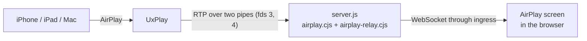

# AirPlay screen

Family can show what an iPhone, iPad or Mac sends it over AirPlay: a
mirrored screen, or the cover and title of the music it's playing, with
the sound. It's a screen like the photo frame: it covers the display, and
a tap brings up the back button.

**It isn't turned on in this add-on.** All of the code is here, but the
add-on's image doesn't include the AirPlay receiver (UxPlay), and the
add-on isn't on the host's network, which AirPlay needs. Without both,
run.sh keeps the receiver off, the sidebar doesn't offer the screen, and
none of this runs. Each is a decision for whoever maintains the add-on
(see [Turning it on](#turning-it-on)).

## How it works



- **UxPlay** ([FDH2/UxPlay](https://github.com/FDH2/UxPlay), GPL-3.0) is
  the AirPlay receiver: it advertises it (through Avahi, over D-Bus),
  accepts the device and decrypts what it sends. airplay.cjs starts it with
  `-vrtp` and `-artp`, so instead of showing the picture and playing the
  sound itself, it writes them as RTP to two pipes the server gives it.
- **airplay.cjs** runs UxPlay (again, after it stops, with a growing
  delay), and works out the status from what it writes: nobody connected,
  a device connected, its screen mirrored, or its music playing, with the
  track and cover art.
- **airplay-relay.cjs** turns the RTP into H.264 access units (SPS and PPS
  with every keyframe) and PCM (44.1 kHz, stereo, 16-bit big-endian), and
  sends them to every AirPlay screen. A screen that connects is sent the
  picture from the last keyframe, so it doesn't wait for the next one.
- **server.js** serves:
  - `GET /beacon-action/airplay`: the status (`{"enabled":false}` while
    the receiver is off);
  - `GET /beacon-action/airplay/cover`: the cover art, or 404;
  - `/beacon-action/airplay/stream`: a WebSocket with the status as text
    (on connecting, on each change, and every 15 s), and the picture and
    sound as binary messages. Each has a 10-byte header: the type (1
    video, 2 audio), flags (1 keyframe, 2 replayed on connecting, 0x80
    continued in the next message), and when the add-on received it (ms,
    float64 big-endian).
- **In the browser** (downloaded the first time the screen opens):
  - `src/components/AirPlayView.tsx`: the screen, and its connection
    (again after a drop, waiting 1 s, then 2 s, up to 15 s);
  - `src/utils/fmp4.ts`: wraps each access unit in a fragmented MP4
    segment;
  - `src/utils/airplay-video.ts`: plays them with Media Source Extensions
    (ManagedMediaSource on iPhone and iPad), close to live: it plays at
    1.25× while more than 0.15 s behind and jumps ahead when more than
    0.5 s behind;
  - `src/utils/airplay-audio.ts`: plays the sound with Web Audio.
- **App** (`src/hooks/useAirPlay.ts`): every 3 s while the receiver is on
  (every 5 minutes while it's off), it checks the status. The sidebar
  offers the screen only while the receiver is on. Displays set to open
  it by themselves switch to it when a device starts sending, stay on
  without the screen saver while showing it, and go back when it stops.

## Turning it on

Two changes, each a decision to make on purpose.

### 1. UxPlay in the image

UxPlay would have to be built from source in a separate Dockerfile stage
on the same base image (Alpine), with only its `uxplay` binary copied
into the runtime stage. The Supervisor builds this add-on on each Home
Assistant machine (nothing publishes an image), so it would compile there.

- **Version and source:** UxPlay 1.73.6. The GitHub archive
  `https://github.com/FDH2/UxPlay/archive/refs/tags/v1.73.6.tar.gz` had
  this sha512 when this was written; check it again, and have the build
  check it:
  `b8acd7737e5bbd5dd9f0a4dd08a5fe0eb73c7302f6d08167e4a86f9cc6834efd36320aaa8551ec0fd3597f8c5ebce60fe7abf4a2a0ca0f1957508cfe73bca9dd`
- **To build it:** CMake, a C/C++ compiler, and the development files for
  OpenSSL, libplist, Avahi's `dns_sd` compatibility library and GStreamer
  (with its base plugins). UxPlay's README lists them per distribution.
- **In the runtime stage:**
  - the libraries it links against;
  - the GStreamer elements the `-vrtp`/`-artp` pipelines in airplay.cjs
    use (`rtph264pay`, `rtpstreampay`, `fdsink`); `gst-inspect-1.0` in
    the built image shows whether they're there;
  - `dbus` and `avahi` (the services in `rootfs/etc/services.d` run
    `dbus-daemon`, `dbus-uuidgen` and `avahi-daemon`);
  - a system user named `airplay`, e.g.
    `adduser -S -D -H -s /sbin/nologin airplay`. airplay.cjs won't start
    UxPlay as root.
- **Licence:** shipping UxPlay's binary means shipping, or offering, its
  source (the pinned archive, and any patches) and its licence. Family
  runs it as a separate program and talks to it only through pipes and
  files, which the GPL generally treats as two programs rather than one
  combined work, so Family's own code can stay MIT. Worth confirming for
  your own distribution.

### 2. The host's network

iPhones, iPads and Macs find AirPlay receivers with mDNS (Bonjour) on the
local network, and then connect straight to the receiver's ports. Neither
reaches an add-on on its own Docker network. In `config.yaml`:

```yaml
host_network: true
# On the host's network, port 3000 may be taken: the Supervisor picks a
# free port, which run.sh reads and serves on.
ingress_port: 0
options:
  # ...the existing options, and:
  airplay: true
  airplay_name: "Family"
  airplay_password: ""
schema:
  # ...the existing schema, and:
  airplay: bool
  airplay_name: str?
  airplay_password: password?
```

What that changes:

- The add-on shares the host's network. Its web server is then on the
  host's addresses, but server.js still accepts only Home Assistant's
  ingress proxy (172.30.32.2) and its own health check, for pages and for
  the stream.
- UxPlay listens for AirPlay on the host's network, as any AirPlay
  receiver does. Anyone on the network can send to it unless
  `airplay_password` is set (at least 4 characters, not starting with
  `-`).
- Avahi answers for `family-airplay`, beside Home Assistant's own mDNS
  responder, and not on Home Assistant's internal networks.
- Home Assistant shows a lower security rating for add-ons on the host's
  network.

`airplay: false` turns the receiver off again without either change being
undone.

## What protects it

- UxPlay runs as the `airplay` user, never root, and can write only its
  own two folders (its files, and its key in `/data/airplay`). The server
  reads what it writes without following links, and only so much of it.
- Before starting it, run.sh makes what that user could otherwise read
  private: s6's copy of the environment (with the Supervisor token),
  bashio's cache of the options, and the family's data in `/data`.
- The picture and sound come from UxPlay through pipes, not network
  ports, so nothing else on the host can send packets into them.
- The status, cover and stream are only for parent sessions: a Kid
  Display gets 403. The stream refuses cross-origin connections.
- D-Bus and Avahi only run while the receiver is on.

## What it costs

- **Building:** UxPlay compiling on each Home Assistant machine when the
  add-on is installed or updated: minutes on a Raspberry Pi. The image
  grows by UxPlay, GStreamer, D-Bus and Avahi, roughly 150-250 MB (an
  estimate; not measured).
- **Running:** UxPlay, D-Bus and Avahi use little until something is
  sent. The Home Assistant machine only forwards the stream; each display
  decodes the picture itself. A mirrored screen is a few megabits a
  second to each display showing it.

## Limitations

- **Not tested with a real iPhone, iPad or Mac**, on an Echo Show, or in
  the Home Assistant app. The browser side was checked once, in desktop
  Chrome, with an H.264 stream made by the browser's own encoder; the
  catch-up playback rate is covered only by unit tests.
- Screen mirroring and music only, in H.264. A video app's own AirPlay
  button, which hands over a web address rather than the screen
  (UxPlay's HLS mode), isn't supported: use Screen Mirroring instead.
- The picture needs Media Source Extensions. On an iPhone or iPad used as
  a display, that's iOS or iPadOS 17.1 or later; before that, the sound
  still plays and the screen says why there's no picture.
- The sound and picture play separately and aren't kept in step: the
  sound can be about a tenth of a second behind.
- Browsers keep the sound off until the page has been tapped, unless the
  kiosk browser allows it: the screen shows **Tap for sound**.
- Every display set to open AirPlay by itself shows it, and plays its
  sound. The setting (Settings > Display > Open AirPlay Automatically) is
  kept on each display: turn it off on the others.
- One device at a time: a second one takes over from the first.
